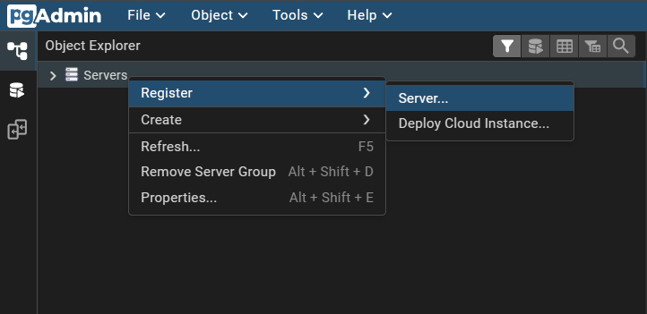
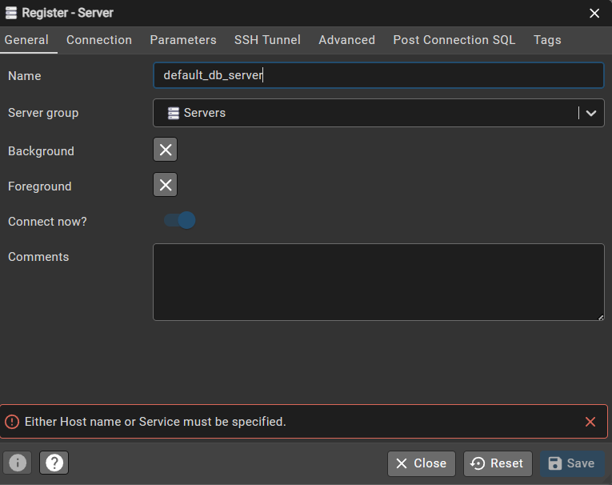
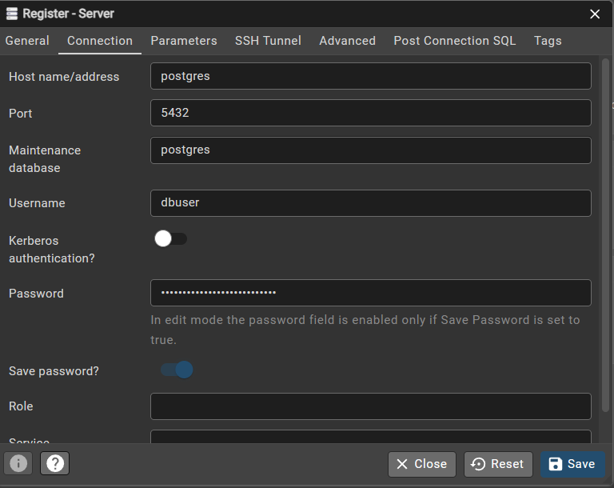
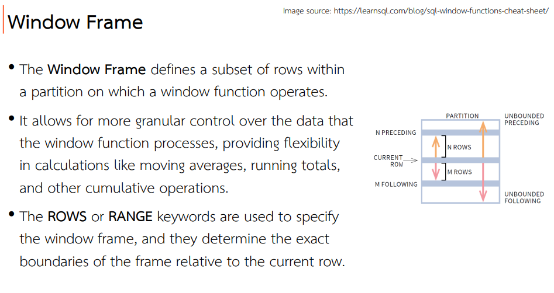
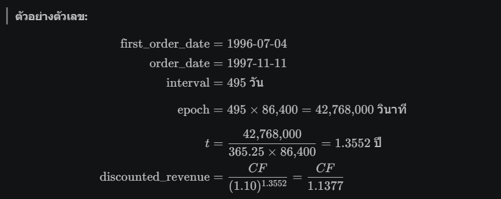

# Advanced Data Analysis and Query Optimization Using SQL

- Section I — Advanced Joins & Set Operations (Q1–Q8)
- Section II — Advanced Subqueries (Q9–Q14)
- Section III — Performance Tuning & Query Rewriting (Q15–Q17)
- Section IV — Common Table Expressions (CTEs) (Q18–Q21)
- Section V — Window Functions (Q22–Q30)

## PG4ADMIN

URL: http://pgadmin4.datacaster.org/

Username
```
user_XXX@datacaster.org
```
XXX แทนด้วยลำดับของท่านที่ได้รับจาก TA

Password
```
strange_stoic_shannon
```

## การเพิ่ม PostgreSQL Database 

Username
```
dbuser
```

Password
```
tenacious_trusting_torvalds
```







## Data set


---
## Section I — Advanced Joins & Set Operations (Q1–Q8)
---

### Q1 : พนักงานและหัวหน้าตัวเอง (SELF JOIN แบบ equi)
**Topic:** `SELF JOIN`

**Scenario:**
HR ต้องการรายงานแสดงชื่อพนักงานคู่กับชื่อ Manager ของแต่ละคน โดยใช้ SELF JOIN บน employees table ที่มี ReportsTo อ้างอิงถึง EmployeeID ตัวเอง

**Task:**
แสดง EmployeeName, ManagerName เรียงตาม EmployeeName (เฉพาะพนักงานที่มีหัวหน้า)

**Sample Data:**

*Table: `employees`*

| EmployeeID | FirstName | LastName | ReportsTo |
| --- | --- | --- | --- |
| 1 | Nancy | Davolio | 2 |
| 2 | Andrew | Fuller |  |
| 3 | Janet | Leverling | 2 |
| 5 | Steven | Buchanan | 2 |
| 6 | Michael | Suyama | 5 |

**Expected Output:**

| EmployeeName | ManagerName |
| --- | --- |
| Janet Leverling | Andrew Fuller |
| Michael Suyama | Steven Buchanan |
| Nancy Davolio | Andrew Fuller |
| Steven Buchanan | Andrew Fuller |

<details>
<summary>Solution</summary>

```sql
SELECT CONCAT(e.first_name, ' ', e.last_name) AS employee_name,
       CONCAT(m.first_name, ' ', m.last_name) AS manager_name
FROM employees e
JOIN employees m ON e.reports_to = m.employee_id
ORDER BY employee_name;
```

</details>

---

### Q2 : หาคู่สินค้าที่ราคาห่างกันไม่เกิน 5 บาท (ในหมวดเดียวกัน)
**Topic:** `NON-EQUI SELF JOIN`

**Scenario:**
ทีม Pricing ต้องการหาคู่สินค้าที่อยู่ใน Category เดียวกันและมีราคาใกล้เคียงกัน (ต่างกันไม่เกิน 5) เพื่อวิเคราะห์ competitive pricing โดยไม่ให้จับคู่กับตัวเอง และให้ ProductID ของ a น้อยกว่า b เสมอ

**Task:**
แสดง ProductA, ProductB, PriceA, PriceB, PriceDiff เรียงตาม PriceDiff

**Sample Data:**

*Table: `products (sample)`*

| ProductID | ProductName | CategoryID | UnitPrice |
| --- | --- | --- | --- |
| 1 | Chai | 1 | 18.00 |
| 2 | Chang | 1 | 19.00 |
| 24 | Guaraná Fantástica | 1 | 4.50 |
| 35 | Steeleye Stout | 1 | 18.00 |
| 38 | Côte de Blaye | 1 | 263.50 |

**Expected Output:**

| ProductA | ProductB | PriceA | PriceB | PriceDiff |
| --- | --- | --- | --- | --- |
| Chai | Chang | 18.00 | 19.00 | 1.00 |
| Chai | Steeleye Stout | 18.00 | 18.00 | 0.00 |
| Chang | Steeleye Stout | 19.00 | 18.00 | 1.00 |

<details>
<summary>Solution</summary>

```sql
SELECT a.product_name AS product_a,
       b.product_name AS product_b,
       a.unit_price AS price_a,
       b.unit_price AS price_b,
       ROUND(CAST(ABS(a.unit_price - b.unit_price) AS DECIMAL(10,2)), 2) AS price_diff
FROM products a
JOIN products b ON a.category_id = b.category_id
               AND a.product_id < b.product_id
WHERE ABS(a.unit_price - b.unit_price) <= 5
ORDER BY price_diff;
```

</details>

---

### Q6 : เมืองที่มีทั้ง Customer และ Supplier (INTERSECT)
**Topic:** `UNION / INTERSECT / EXCEPT`

**Scenario:**
ทีม Logistics ต้องการรู้ว่ามีเมืองใดบ้างที่มีทั้งลูกค้าและ Supplier อยู่ด้วยกัน เพื่อวางแผนจุดรับ-ส่งสินค้า

**Task:**
แสดงรายชื่อ City ที่ปรากฏในทั้ง customers และ suppliers เรียง A-Z

**Sample Data:**

*Table: `customers (sample)`*

| customer_id | city |
| --- | --- |
| ALFKI | Berlin |
| ANATR | Mexico City |
| AROUT | London |

*Table: `suppliers (sample)`*

| supplier_id | city |
| --- | --- |
| 1 | London |
| 2 | New Orleans |
| 3 | Berlin |

**Expected Output:**

| city |
| --- |
| Berlin |
| London |

<details>
<summary>Solution</summary>

```sql
SELECT city FROM customers
INTERSECT
SELECT city FROM suppliers
ORDER BY city;
```

</details>

---

### Q7 · ประเทศที่มี Customer แต่ไม่มี Supplier
**Topic:** `EXCEPT`

**Scenario:**
ทีม Procurement ต้องการรู้ว่าประเทศใดมีลูกค้าแต่ยังไม่มี Supplier อยู่ เพื่อวางแผนหา Supplier ใหม่

**Task:**
แสดงรายชื่อ Country ที่อยู่ใน customers แต่ไม่อยู่ใน suppliers เรียง A-Z

**Sample Data:**

*Table: `customers (sample)`*

| customer_id | country |
| --- | --- |
| ALFKI | Germany |
| ANATR | Mexico |
| AROUT | UK |
| BERGS | Sweden |

*Table: `suppliers (sample)`*

| supplier_id | country |
| --- | --- |
| 1 | UK |
| 2 | USA |
| 3 | Germany |

**Expected Output:**

| country |
| --- |
| Mexico |
| Sweden |

<details>
<summary>Solution</summary>

```sql
SELECT country FROM customers
EXCEPT
SELECT country FROM suppliers
ORDER BY country;
```

</details>

---

### Q8 · รวม log การสั่งซื้อจาก 2 ปี (UNION ALL รักษา duplicate)
**Topic:** `UNION ALL`

**Scenario:**
ทีม Data Eng ต้องการ combine คำสั่งซื้อจากปี 1996 และ 1997 ไว้ในชุดเดียวกัน โดยเก็บซ้ำไว้หมด (ไม่ตัด) และเพิ่ม column Year บอกที่มา

**Task:**
แสดง OrderID, CustomerID, OrderDate, Source ('1996' หรือ '1997') เรียงตาม OrderDate

**Sample Data:**

*Table: `orders (sample)`*

| order_id | customer_id | order_date |
| --- | --- | --- |
| 10248 | VINET | 1996-07-04 |
| 10249 | TOMSP | 1996-07-05 |
| 10400 | EASTC | 1997-01-01 |
| 10401 | HANAR | 1997-01-01 |

**Expected Output:**

| order_id | customer_id | order_date | source |
| --- | --- | --- | --- |
| 10248 | VINET | 1996-07-04 | 1996 |
| 10249 | TOMSP | 1996-07-05 | 1996 |
| 10400 | EASTC | 1997-01-01 | 1997 |
| 10401 | HANAR | 1997-01-01 | 1997 |

<details>
<summary>Solution</summary>

```sql
SELECT order_id, customer_id, order_date, '1996' AS source
FROM orders
WHERE EXTRACT(YEAR FROM order_date) = 1996
UNION ALL
SELECT order_id, customer_id, order_date, '1997' AS source
FROM orders
WHERE EXTRACT(YEAR FROM order_date) = 1997
ORDER BY order_date;
```

</details>

---

### Challenge A :  City เดียวกัน

**Scenario:**


มีพนักงานคู่ไหนบ้างที่เคย ship order ไปในเมืองเดียวกัน (จากทั้งปี 1996 และ 1997)
และทั้งคู่ต้องรายงานถึง Manager คนเดียวกัน

**Task:**

แสดง `city`, `employee_a`, `employee_b`, `manager_name`, `order_year`

โดย:
- `employee_a` / `employee_b` — คู่พนักงานที่ `reports_to` เดียวกัน และ id ของ a < b (NON-EQUI SELF JOIN)
- `manager_name` — Manager ของทั้งคู่ (SELF JOIN equi)
- `order_year` — '1996' หรือ '1997' จาก UNION ALL

เรียงตาม `city`, `order_year`, `employee_a`

---

**Sample Data:**

*Table: `employees`*

| employee_id | first_name | last_name | reports_to |
| --- | --- | --- | --- |
| 1 | Nancy | Davolio | 2 |
| 2 | Andrew | Fuller | NULL |
| 3 | Janet | Leverling | 2 |
| 5 | Steven | Buchanan | 2 |
| 6 | Michael | Suyama | 5 |

*Table: `customers (sample)`*

| customer_id | city |
| --- | --- |
| AROUT | London |
| BSBEV | London |
| ANATR | Mexico City |

*Table: `suppliers (sample)`*

| supplier_id | company_name | city |
| --- | --- | --- |
| 1 | Exotic Liquids | London |
| 2 | New Orleans Cajun | New Orleans |
| 3 | Grandma Kelly's | Ann Arbor |

*Table: `orders (sample)`*

| order_id | employee_id | ship_city | order_date |
| --- | --- | --- | --- |
| 10248 | 5 | New Orleans | 1996-07-04 |
| 10400 | 3 | Ann Arbor | 1997-01-01 |
| 10401 | 1 | Ann Arbor | 1997-01-01 |

**Expected Output:**

| City | employee_a | employee_b | manager_name | order_year |
| --- | --- | --- | --- | --- |
| --- | Janet Leverling | Nancy Davolio | Andrew Fuller | 1997 |
| --- | ... | ... | ... | 1996 |
| --- | ... | ... | ... | 1997 |

```sql
-- เดี๋ยวผม (น้องบูม) มาใส่ solution ที่สมบูรณ์ให้นะครับ (ขอโทษครับ T_T)
SELECT e_a.employee_id, e_b.employee_id, o_a.ship_city
FROM orders o_a
JOIN employees e_a ON o_a.employee_id = e_a.employee_id
JOIN orders o_b ON o_a.ship_city = o_b.ship_city
JOIN employees e_b ON o_b.employee_id = e_b.employee_id
WHERE EXTRACT(YEAR from o_a.order_date) IN (1996, 1997)
AND e_a.reports_to = e_b.reports_to
```

---


## Section II — Advanced Subqueries (Q9–Q14)

---

### Q9 : ลูกค้าที่มีคำสั่งซื้ออย่างน้อย 1 รายการ (EXISTS)
**Topic:** `EXISTS`

**Scenario:**
ทีม CRM ต้องการดึงเฉพาะลูกค้าที่เคยสั่งซื้อจริงอย่างน้อย 1 ครั้ง โดยใช้ EXISTS ซึ่งเร็วกว่า IN สำหรับ subquery ขนาดใหญ่

**Task:**
แสดง CustomerID, CompanyName เรียง CompanyName

**Sample Data:**

*Table: `customers`*

| customer_id | company_name |
| --- | --- |
| ALFKI | Alfreds Futterkiste |
| ANATR | Ana Trujillo |
| BOLID | Bólido Comidas |

*Table: `orders`*

| order_id | customer_id |
| --- | --- |
| 10248 | ALFKI |
| 10249 | ALFKI |
| 10250 | ANATR |

**Expected Output:**

| customer_id | company_name |
| --- | --- |
| ALFKI | Alfreds Futterkiste |
| ANATR | Ana Trujillo |

<details>
<summary>Solution</summary>

```sql
SELECT c.customer_id, c.company_name
FROM customers c
WHERE EXISTS (
    SELECT 1 FROM orders o
    WHERE o.customer_id = c.customer_id
)
ORDER BY c.company_name;
```

</details>

---

### Q10 : ลูกค้าที่ไม่เคยสั่งซื้อเลย (NOT EXISTS)
**Topic:** `NOT EXISTS`

**Scenario:**
ทีม Sales ต้องการ list ลูกค้าที่ยังไม่เคยมี Order เพื่อทำ re-engagement campaign

**Task:**
แสดง CustomerID, CompanyName, Country เรียง CompanyName

**Sample Data:**

*Table: `customers`*

| customer_id | company_name | country |
| --- | --- | --- |
| ALFKI | Alfreds Futterkiste | Germany |
| ANATR | Ana Trujillo | Mexico |
| BOLID | Bólido Comidas | Spain |

*Table: `orders`*

| order_id | customer_id |
| --- | --- |
| 10248 | ALFKI |
| 10249 | ANATR |

**Expected Output:**

| customer_id | company_name | country |
| --- | --- | --- |
| BOLID | Bólido Comidas | Spain |

<details>
<summary>Solution</summary>

```sql
SELECT c.customer_id, c.company_name, c.country
FROM customers c
WHERE NOT EXISTS (
    SELECT 1 FROM orders o
    WHERE o.customer_id = c.customer_id
)
ORDER BY c.company_name;
```

</details>

---

### Q11 : สินค้าที่แพงกว่าทุกชิ้นใน Category Seafood (ALL)
**Topic:** `ALL`

**Scenario:**
ทีม Pricing ต้องการหาสินค้าที่มีราคาสูงกว่าทุกสินค้าใน Category Seafood เพื่อระบุ premium products

**Task:**
แสดง ProductName, UnitPrice, CategoryID เรียงตาม UnitPrice DESC

**Sample Data:**

*Table: `products (sample)`*

| product_id | product_name | category_id | unit_price |
| --- | --- | --- | --- |
| 10 | Ikura | 8 | 31.00 |
| 13 | Konbu | 8 | 6.00 |
| 18 | Carnarvon Tigers | 8 | 62.50 |
| 38 | Côte de Blaye | 1 | 263.50 |
| 29 | Thüringer Rostbratwurst | 6 | 123.79 |

*Table: `categories (sample)`*

| category_id | category_name |
| --- | --- |
| 1 | Beverages |
| 6 | Meat/Poultry |
| 8 | Seafood |

**Expected Output:**

| product_name | unit_price | category_id |
| --- | --- | --- |
| Côte de Blaye | 263.50 | 1 |
| Thüringer Rostbratwurst | 123.79 | 6 |

<details>
<summary>Solution</summary>

```sql
SELECT product_name, unit_price, category_id
FROM products
WHERE unit_price > ALL (
    SELECT unit_price FROM products
    WHERE category_id = (
        SELECT category_id FROM categories
        WHERE category_name = 'Seafood'
    )
)
ORDER BY unit_price DESC;
```

</details>

---

### Q12 : พนักงานที่มี Freight Order อย่างน้อย 1 รายการสูงกว่า 100 (ANY)
**Topic:** `ANY / SOME`

**Scenario:**
ทีม Ops ต้องการหาพนักงานที่เคยรับออเดอร์ที่มี Freight สูงกว่า 100 อย่างน้อย 1 ครั้ง

**Task:**
แสดง EmployeeID, FullName เรียงตาม EmployeeID

**Sample Data:**

*Table: `employees`*

| employee_id | first_name | last_name |
| --- | --- | --- |
| 1 | Nancy | Davolio |
| 2 | Andrew | Fuller |
| 3 | Janet | Leverling |

*Table: `orders`*

| order_id | employee_id | freight |
| --- | --- | --- |
| 10248 | 1 | 32.38 |
| 10249 | 1 | 11.61 |
| 10250 | 2 | 65.83 |
| 10251 | 2 | 151.30 |
| 10252 | 3 | 41.34 |

**Expected Output:**

| employee_id | full_name |
| --- | --- |
| 2 | Andrew Fuller |

<details>
<summary>Solution</summary>

```sql
SELECT e.employee_id,
       CONCAT(e.first_name, ' ', e.last_name) AS full_name
FROM employees e
WHERE e.employee_id = ANY (
    SELECT employee_id FROM orders
    WHERE freight > 100
)
ORDER BY e.employee_id;
```

</details>

---

### Challenge B : Loyal but Forgotten

**Scenario:**

ทีม CRM สังเกตว่ามีลูกค้าบางกลุ่มที่ **หายไปเงียบ ๆ ในปี 1998**
ทั้ง ๆ ที่ก่อนหน้านี้สั่งซื้อสม่ำเสมอ

ที่น่าสนใจกว่านั้น — ลูกค้ากลุ่มนี้เคยซื้อสินค้าที่แพงกว่า
**ทุกสินค้าที่ supplier จากประเทศ Germany ขาย** อย่างน้อย 1 ครั้ง

ทีมต้องการตามหาคนกลุ่มนี้เพื่อส่ง offer พิเศษ

**Task:**

แสดง `customer_id`, `company_name`, `country`
ของลูกค้าที่ตรงเงื่อนไขทั้งหมด เรียงตาม `company_name`

เงื่อนไข:
1. เคยสั่งซื้ออย่างน้อย 1 ครั้ง (EXISTS)
2. ไม่มี order ในปี 1998 เลย (NOT EXISTS)
3. เคยสั่งสินค้าที่มีราคาแพงกว่าทุกสินค้าที่ supplier จากเยอรมนีขาย (> ALL)
4. customer_id ของลูกค้ากลุ่มนี้ต้องปรากฏใน order ที่มี freight > 100 อย่างน้อย 1 ใบ (= ANY)

---

**Sample Data:**

*Table: `customers`*

| customer_id | company_name | country |
| --- | --- | --- |
| ALFKI | Alfreds Futterkiste | Germany |
| ANATR | Ana Trujillo | Mexico |
| BOLID | Bólido Comidas | Spain |
| ERNSH | Ernst Handel | Austria |

*Table: `orders (sample)`*

| order_id | customer_id | order_date | freight |
| --- | --- | --- | --- |
| 10248 | ALFKI | 1996-07-04 | 32.38 |
| 10400 | ALFKI | 1997-01-01 | 83.93 |
| 10500 | ANATR | 1998-02-10 | 15.20 |
| 10501 | ERNSH | 1997-03-01 | 204.47 |

*Table: `order_details (sample)`*

| order_id | product_id |
| --- | --- |
| 10248 | 38 |
| 10501 | 10 |

*Table: `products (sample)`*

| product_id | product_name | supplier_id | unit_price |
| --- | --- | --- | --- |
| 38 | Côte de Blaye | 18 | 263.50 |
| 10 | Ikura | 4 | 31.00 |
| 11 | Queso Cabrales | 5 | 21.00 |

*Table: `suppliers (sample)`*

| supplier_id | company_name | country |
| --- | --- | --- |
| 4 | Tokyo Traders | Japan |
| 5 | Cooperativa | Spain |
| 12 | Plutzer | Germany |

**Expected Output:**

| customer_id | company_name | country |
| --- | --- | --- |
| ALFKI | Alfreds Futterkiste | Germany |
| ERNSH | Ernst Handel | Austria |
| ... | ... | ... |

> ANATR ตกรอบ — มี order ปี 1998
> BOLID ตกรอบ — ไม่เคยสั่งซื้อเลย
> ลูกค้าที่ผ่านต้องเคยซื้อสินค้าที่แพงกว่าทุกชิ้นที่ German suppliers ขาย

---


### Q13 : สินค้าที่ราคาสูงกว่าค่าเฉลี่ยของ Category ตัวเอง (Derived Table)
**Topic:** `Derived Table (Subquery in FROM)`

**Scenario:**
ต้องการหาสินค้าที่ราคาสูงกว่าค่าเฉลี่ยของ Category ตัวเอง โดยใช้ Derived Table (subquery ใน FROM) แทน correlated subquery เพื่อ performance ที่ดีกว่า

**Task:**
แสดง ProductName, CategoryName, UnitPrice, AvgCategoryPrice (ทศนิยม 2) เรียงตาม CategoryName, UnitPrice DESC

**Sample Data:**

*Table: `categories`*

| category_id | category_name |
| --- | --- |
| 1 | Beverages |
| 2 | Condiments |

*Table: `products`*

| product_id | product_name | category_id | unit_price |
| --- | --- | --- | --- |
| 1 | Chai | 1 | 18.00 |
| 2 | Chang | 1 | 19.00 |
| 38 | Côte de Blaye | 1 | 263.50 |
| 3 | Aniseed Syrup | 2 | 10.00 |
| 4 | Chef Anton's | 2 | 22.00 |

**Expected Output:**

| product_name | category_name | unit_price | avg_category_price |
| --- | --- | --- | --- |
| Côte de Blaye | Beverages | 263.50 | 100.17 |
| Chef Anton's | Condiments | 22.00 | 16.00 |

<details>
<summary>Solution</summary>

```sql
SELECT p.product_name, c.category_name, p.unit_price,
       ROUND(CAST(ca.avg_price AS DECIMAL(10,2)), 2) AS avg_category_price
FROM products p
JOIN categories c ON p.category_id = c.category_id
JOIN (
    SELECT category_id, AVG(unit_price) AS avg_price
    FROM products
    GROUP BY category_id
) ca ON p.category_id = ca.category_id
     AND p.unit_price > ca.avg_price
ORDER BY c.category_name, p.unit_price DESC;
```

</details>

---

### Q14 : เปรียบเทียบ: หาพนักงานที่มียอดสูงกว่าค่าเฉลี่ย (Rewrite correlated → JOIN)
**Topic:** `Correlated Subquery vs EXISTS Performance`

**Scenario:**
Query เดิมใช้ correlated subquery ซึ่งช้า ต้องการ rewrite เป็น JOIN กับ Derived Table แทน (ตามแนวทางใน slide Index Strategy)

**Task:**
แสดง EmployeeName, TotalFreight, AvgAllFreight (ทศนิยม 2) เฉพาะพนักงานที่มี TotalFreight เกินค่าเฉลี่ยรวม เรียงตาม TotalFreight DESC

**Sample Data:**

*Table: `employees`*

| employee_id | first_name | last_name |
| --- | --- | --- |
| 1 | Nancy | Davolio |
| 2 | Andrew | Fuller |
| 3 | Janet | Leverling |

*Table: `orders`*

| order_id | employee_id | freight |
| --- | --- | --- |
| 10248 | 1 | 32.38 |
| 10249 | 1 | 11.61 |
| 10250 | 2 | 65.83 |
| 10251 | 2 | 51.30 |
| 10252 | 3 | 5.00 |

**Expected Output:**

| employee_name | total_freight | avg_all_freight |
| --- | --- | --- |
| Andrew Fuller | 117.13 | 33.22 |
| Nancy Davolio | 43.99 | 33.22 |

<details>
<summary>Solution</summary>

```sql
-- ช้า: correlated subquery
-- WHERE SUM(freight) > (SELECT AVG(...) FROM ...)

-- เร็ว: JOIN กับ derived table
SELECT CONCAT(e.first_name, ' ', e.last_name) AS employee_name,
       ROUND(CAST(emp_total.total_freight AS DECIMAL(10,2)), 2) AS total_freight,
       ROUND(CAST(global_avg.avg_all_freight AS DECIMAL(10,2)), 2) AS avg_all_freight
FROM employees e
JOIN (
    SELECT employee_id, SUM(freight) AS total_freight
    FROM orders
    GROUP BY employee_id
) emp_total ON e.employee_id = emp_total.employee_id
JOIN (
    SELECT AVG(total) AS avg_all_freight
    FROM (SELECT employee_id, SUM(freight) AS total FROM orders GROUP BY employee_id) t
) global_avg ON emp_total.total_freight > global_avg.avg_all_freight
ORDER BY total_freight DESC;
```

</details>

---

## Section III — Performance Tuning & Query Rewriting (Q15–Q17)

---

### Q15 : Rewrite: หา Order ในปี 1997 โดยไม่ใช้ Function บน indexed column
**Topic:** `Query Rewriting: BETWEEN แทน YEAR()`

**Scenario:**
Query เดิม: WHERE EXTRACT(YEAR FROM OrderDate) = 1997 ซึ่งทำให้ DB ไม่สามารถใช้ Index บน OrderDate ได้ ให้ rewrite เป็น range predicate แทนตามแนวทางใน slide

**Task:**
แสดง OrderID, CustomerID, OrderDate เรียงตาม OrderDate โดยเขียน WHERE แบบ BETWEEN เพื่อ index-friendly

**Sample Data:**

*Table: `orders (sample)`*

| order_id | customer_id | order_date |
| --- | --- | --- |
| 10399 | VAFFE | 1996-12-31 |
| 10400 | EASTC | 1997-01-01 |
| 10401 | HANAR | 1997-06-15 |
| 10402 | ERNSH | 1997-12-31 |
| 10403 | MEREP | 1998-01-01 |

**Expected Output:**

| order_id | customer_id | order_date |
| --- | --- | --- |
| 10400 | EASTC | 1997-01-01 |
| 10401 | HANAR | 1997-06-15 |
| 10402 | ERNSH | 1997-12-31 |

<details>
<summary>Solution</summary>

```sql
-- ช้า: function บน indexed column
-- WHERE EXTRACT(YEAR FROM order_date) = 1997

-- เร็ว: range predicate — index ใช้ได้
SELECT order_id, customer_id, order_date
FROM orders
WHERE order_date BETWEEN '1997-01-01' AND '1997-12-31'
ORDER BY order_date;
```

</details>

---

### Q16 : หา Category ที่มีสินค้า Discontinued (ใช้ EXISTS แทน COUNT)
**Topic:** `EXISTS แทน COUNT(*) > 0`

**Scenario:**
Query เดิมใช้ COUNT(*) > 0 ซึ่งต้องนับทุก row ก่อน ให้ rewrite ด้วย EXISTS ซึ่งหยุดทันทีที่เจอ row แรก

**Task:**
แสดง CategoryID, CategoryName เฉพาะ Category ที่มีสินค้า Discontinued = 1 เรียง CategoryName

**Sample Data:**

*Table: `categories`*

| category_id | category_name |
| --- | --- |
| 1 | Beverages |
| 2 | Condiments |
| 3 | Confections |

*Table: `products`*

| product_id | category_id | product_name | discontinued |
| --- | --- | --- | --- |
| 1 | 1 | Chai | 0 |
| 5 | 2 | Chef Anton's Gumbo Mix | 1 |
| 9 | 3 | Mishi Kobe Niku | 1 |
| 10 | 3 | Ikura | 0 |

**Expected Output:**

| category_id | category_name |
| --- | --- |
| 2 | Condiments |
| 3 | Confections |

<details>
<summary>Solution</summary>

```sql
-- ช้า: COUNT(*) > 0
-- WHERE (SELECT COUNT(*) FROM products WHERE ...) > 0

-- เร็ว: EXISTS หยุดทันทีที่เจอ row แรก
SELECT c.category_id, c.category_name
FROM categories c
WHERE EXISTS (
    SELECT 1 FROM products p
    WHERE p.category_id = c.category_id
      AND p.discontinued = 1
)
ORDER BY c.category_name;
```

</details>

---

### Challenge C : The Slow Movers

**Scenario:**

ทีม Inventory สังเกตว่ามีสินค้าบางชิ้นที่ **ขายช้าผิดปกติ**
ทั้ง ๆ ที่อยู่ใน category ที่โดยรวมขายดี

สินค้าพวกนี้คือ "slow mover" — ยอดขายต่ำกว่าค่าเฉลี่ยของ category ตัวเอง
แต่ category นั้นยังมีสินค้าที่ขายดีอยู่ด้วย (ไม่ใช่ category ที่แย่ทั้งหมด)

และต้องเป็นสินค้าที่ยัง **active** อยู่ (discontinued = 0) เพื่อให้ worth investigating

**Task:**

แสดง `product_name`, `category_name`, `total_revenue`, `avg_category_revenue`
ของสินค้าที่เป็น slow mover เรียงตาม `category_name`, `total_revenue`

เงื่อนไข:
1. `total_revenue` ต่ำกว่าค่าเฉลี่ย revenue ของ category ตัวเอง (Derived Table)
2. category นั้นมีสินค้าที่ขายดีกว่าค่าเฉลี่ยอยู่ด้วยอย่างน้อย 1 ชิ้น (EXISTS)
3. สินค้ายังไม่ discontinued (EXISTS แทน WHERE ตรง)
4. กรองช่วงเวลาด้วย BETWEEN (ปี 1997 เท่านั้น)

---

**Sample Data:**

*Table: `products`*

| product_id | product_name | category_id | discontinued |
| --- | --- | --- | --- |
| 1 | Chai | 1 | 0 |
| 2 | Chang | 1 | 0 |
| 38 | Côte de Blaye | 1 | 0 |
| 5 | Chef Anton's Gumbo Mix | 2 | 1 |
| 6 | Grandma's Boysenberry | 2 | 0 |

*Table: `categories`*

| category_id | category_name |
| --- | --- |
| 1 | Beverages |
| 2 | Condiments |

*Table: `order_details (sample)`*

| order_id | product_id | quantity | unit_price | discount |
| --- | --- | --- | --- | --- |
| 10400 | 1 | 10 | 18.00 | 0 |
| 10401 | 38 | 5 | 263.50 | 0 |
| 10402 | 2 | 3 | 19.00 | 0 |
| 10403 | 6 | 8 | 25.00 | 0 |

*Table: `orders (sample)`*

| order_id | order_date |
| --- | --- |
| 10400 | 1997-01-01 |
| 10401 | 1997-01-02 |
| 10402 | 1997-01-03 |
| 10403 | 1997-01-15 |

**Expected Output:**

| product_name | category_name | total_revenue | avg_category_revenue |
| --- | --- | --- | --- |
| Chai | Beverages | ... | ... |
| Chang | Beverages | ... | ... |
| Grandma's Boysenberry | Condiments | ... | ... |
| ... | ... | ... | ... |

> Côte de Blaye อยู่เหนือค่าเฉลี่ย Beverages → ไม่ใช่ slow mover
> Chef Anton's Gumbo Mix discontinued = 1 → ตกรอบ
> category ต้องมีสินค้าที่ขายดีอยู่ด้วย → ไม่ใช่ทุก category ที่ผ่าน

---


### Q17 : Top 5 Order ที่มี Freight สูงสุด (ใช้ LIMIT ให้เร็ว)
**Topic:** `LIMIT เพื่อลด work`

**Scenario:**
Dashboard ต้องแสดงแค่ Top 5 Orders ที่มี Freight สูงที่สุด ควรใส่ LIMIT เพื่อลด data ที่ต้องส่งกลับ

**Task:**
แสดง OrderID, CustomerID, EmployeeID, Freight เรียงตาม Freight DESC LIMIT 5

**Sample Data:**

*Table: `orders (sample)`*

| order_id | customer_id | employee_id | freight |
| --- | --- | --- | --- |
| 10372 | QUEEN | 5 | 890.78 |
| 10514 | ERNSH | 3 | 789.95 |
| 10897 | HUNGO | 3 | 603.54 |
| 10817 | RATTC | 5 | 306.07 |
| 10430 | ERNSH | 4 | 458.78 |
| 10359 | SEVES | 5 | 288.43 |

**Expected Output:**

| order_id | customer_id | employee_id | freight |
| --- | --- | --- | --- |
| 10372 | QUEEN | 5 | 890.78 |
| 10514 | ERNSH | 3 | 789.95 |
| 10897 | HUNGO | 3 | 603.54 |
| 10430 | ERNSH | 4 | 458.78 |
| 10817 | RATTC | 5 | 306.07 |

<details>
<summary>Solution</summary>

```sql
SELECT order_id, customer_id, employee_id, freight
FROM orders
ORDER BY freight DESC
LIMIT 5;
```

</details>

---

## Section IV — Common Table Expressions (CTEs) (Q18–Q21)

---

### Q18 : ยอดขายรวมต่อลูกค้า โดยใช้ CTE แทน Subquery ซ้อน
**Topic:** `Basic CTE (WITH)`

**Scenario:**
ทีม BI ต้องการ query ที่อ่านง่าย แสดงยอดขายรวมต่อลูกค้าและเปรียบเทียบกับค่าเฉลี่ยรวม โดยใช้ CTE แทน nested subquery

**Task:**
แสดง CustomerID, TotalRevenue, AvgRevenue (ทศนิยม 2) และ AbovAvg (TRUE/FALSE) เรียงตาม TotalRevenue DESC

**Sample Data:**

*Table: `orders`*

| order_id | customer_id |
| --- | --- |
| 10248 | ALFKI |
| 10249 | ANATR |
| 10250 | ALFKI |
| 10251 | HANAR |

*Table: `order_details`*

| order_id | unit_price | quantity |
| --- | --- | --- |
| 10248 | 14.00 | 12 |
| 10249 | 9.80 | 10 |
| 10250 | 19.00 | 5 |
| 10251 | 7.70 | 15 |

**Expected Output:**

| customer_id | total_revenue | avg_revenue | above_avg |
| --- | --- | --- | --- |
| ALFKI | 263.00 | 131.50 | TRUE |
| HANAR | 115.50 | 131.50 | FALSE |
| ANATR | 98.00 | 131.50 | FALSE |

<details>
<summary>Solution</summary>

```sql
WITH customer_revenue AS (
    SELECT o.customer_id,
           ROUND(CAST(SUM(od.quantity * od.unit_price) AS DECIMAL(10,2)), 2) AS total_revenue
    FROM orders o
    JOIN order_details od ON o.order_id = od.order_id
    GROUP BY o.customer_id
),
avg_revenue AS (
    SELECT ROUND(CAST(AVG(total_revenue) AS DECIMAL(10,2)), 2) AS avg_revenue
    FROM customer_revenue
)
SELECT cr.customer_id, cr.total_revenue, ar.avg_revenue,
       (cr.total_revenue > ar.avg_revenue) AS above_avg
FROM customer_revenue cr, avg_revenue ar
ORDER BY cr.total_revenue DESC;
```

</details>

---

### Q19 : วิเคราะห์ยอดขายพนักงานเทียบ Department avg (Multi-CTE)
**Topic:** `Multi-CTE`

**Scenario:**
ต้องการ Multi-CTE วิเคราะห์พนักงานโดย CTE แรกคำนวณยอดขายรวมต่อพนักงาน CTE ที่สองดึง Top performer แล้ว JOIN กัน

**Task:**
แสดง EmployeeName, TotalRevenue, Rank (ตาม TotalRevenue DESC) โดยใช้อย่างน้อย 2 CTE

**Sample Data:**

*Table: `employees`*

| employee_id | first_name | last_name |
| --- | --- | --- |
| 1 | Nancy | Davolio |
| 2 | Andrew | Fuller |
| 3 | Janet | Leverling |

*Table: `orders`*

| order_id | employee_id |
| --- | --- |
| 10248 | 1 |
| 10249 | 2 |
| 10250 | 2 |
| 10251 | 3 |
| 10252 | 1 |

*Table: `order_details`*

| order_id | unit_price | quantity |
| --- | --- | --- |
| 10248 | 14.00 | 12 |
| 10249 | 9.80 | 10 |
| 10250 | 9.80 | 10 |
| 10251 | 7.70 | 15 |
| 10252 | 5.00 | 10 |

**Expected Output:**

| employee_name | total_revenue | rank |
| --- | --- | --- |
| Nancy Davolio | 218.00 | 1 |
| Andrew Fuller | 196.00 | 2 |
| Janet Leverling | 115.50 | 3 |

<details>
<summary>Solution</summary>

```sql
WITH emp_sales AS (
    SELECT o.employee_id,
           ROUND(CAST(SUM(od.quantity * od.unit_price) AS DECIMAL(10,2)), 2) AS total_revenue
    FROM orders o
    JOIN order_details od ON o.order_id = od.order_id
    GROUP BY o.employee_id
),
emp_ranked AS (
    SELECT employee_id, total_revenue,
           RANK() OVER (ORDER BY total_revenue DESC) AS rank
    FROM emp_sales
)
SELECT CONCAT(e.first_name, ' ', e.last_name) AS employee_name,
       er.total_revenue, er.rank
FROM emp_ranked er
JOIN employees e ON er.employee_id = e.employee_id
ORDER BY er.rank;
```

```sql
WITH emp_sales AS (
	SELECT o.employee_id, SUM(od.unit_price * od.quantity) AS total_revenue
	FROM orders o
	JOIN order_details od ON o.order_id = od.order_id
	GROUP BY o.employee_id
),
emp_ranked AS (
	SELECT es1.employee_id, es1.total_revenue, 
		COUNT(es2.employee_id) + 1 AS rank
	FROM emp_sales es1
	LEFT JOIN emp_sales es2 ON es2.total_revenue > es1.total_revenue
	GROUP BY es1.employee_id, es1.total_revenue
)
SELECT CONCAT(first_name, ' ', last_name) AS employee_name, total_revenue, rank
FROM emp_ranked er
JOIN employees e ON er.employee_id = e.employee_id
ORDER BY er.rank
```

</details>

---

### Q20 : แสดง Org Chart พนักงานทุกระดับ (Recursive CTE)
**Topic:** `Recursive CTE`

**Scenario:**
HR ต้องการ Org Chart แบบ recursive แสดงพนักงานทุกคนพร้อม Level (0 = CEO, 1 = direct report ฯลฯ) และ Path ชื่อ (เช่น Andrew Fuller > Nancy Davolio)

**Task:**
แสดง EmployeeID, FullName, Level, Path เรียงตาม Level, EmployeeID

**Sample Data:**

*Table: `employees`*

| employee_id | first_name | last_name | reports_to |
| --- | --- | --- | --- |
| 1 | Nancy | Davolio | 2 |
| 2 | Andrew | Fuller |  |
| 3 | Janet | Leverling | 2 |
| 5 | Steven | Buchanan | 2 |
| 6 | Michael | Suyama | 5 |

**Expected Output:**

| employee_id | full_name | level | path |
| --- | --- | --- | --- |
| 2 | Andrew Fuller | 0 | Andrew Fuller |
| 1 | Nancy Davolio | 1 | Andrew Fuller > Nancy Davolio |
| 3 | Janet Leverling | 1 | Andrew Fuller > Janet Leverling |
| 5 | Steven Buchanan | 1 | Andrew Fuller > Steven Buchanan |
| 6 | Michael Suyama | 2 | Andrew Fuller > Steven Buchanan > Michael Suyama |

<details>
<summary>Solution</summary>

```sql
WITH RECURSIVE org AS (
    -- Anchor: CEO (ไม่มีหัวหน้า)
    SELECT employee_id,
           CONCAT(first_name, ' ', last_name) AS full_name,
           reports_to,
           0 AS level,
           CONCAT(first_name, ' ', last_name) AS path
    FROM employees
    WHERE reports_to IS NULL

    UNION ALL

    -- Recursive: หา subordinates
    SELECT e.employee_id,
           CONCAT(e.first_name, ' ', e.last_name),
           e.reports_to,
           org.level + 1,
           CONCAT(org.path, ' > ', e.first_name, ' ', e.last_name)
    FROM employees e
    JOIN org ON e.reports_to = org.employee_id
)
SELECT employee_id, full_name, level, path
FROM org
ORDER BY level, employee_id;
```

</details>

---

### Challenge D : Who Reports to a Top Seller

**Scenario:**

Andrew Fuller เป็น CEO ของ Northwind
แต่ทีม HR ตั้งคำถามว่า — **พนักงานที่อยู่ใต้บังคับบัญชาของ top seller ตัวจริงเป็นใคร?**

ไม่ใช่แค่ direct report แต่หมายถึงทุกคนใน subtree ของ org chart
ที่ root คือพนักงานที่มียอดขายสูงสุด

แสดง org chart ของ subtree นั้น พร้อม revenue ของแต่ละคน
เรียงตาม level แล้วตาม revenue มากไปน้อย

**Task:**

แสดง `full_name`, `level` (นับจาก top seller = 0), `path`, `total_revenue`
เรียงตาม `level`, `total_revenue` desc

---

**Sample Data:**

*Table: `employees`*

| employee_id | first_name | last_name | reports_to |
| --- | --- | --- | --- |
| 1 | Nancy | Davolio | 2 |
| 2 | Andrew | Fuller | NULL |
| 3 | Janet | Leverling | 2 |
| 4 | Margaret | Peacock | 2 |
| 5 | Steven | Buchanan | 2 |
| 6 | Michael | Suyama | 5 |
| 7 | Robert | King | 5 |

*Table: `orders`*

| order_id | employee_id |
| --- | --- |
| 10248 | 5 |
| 10249 | 1 |
| 10250 | 3 |

*Table: `order_details`*

| order_id | quantity | unit_price | discount |
| --- | --- | --- | --- |
| 10248 | 12 | 14.00 | 0 |
| 10249 | 10 | 9.80 | 0.05 |
| 10250 | 5 | 263.50 | 0 |

**Expected Output:**

| full_name | level | path | total_revenue |
| --- | --- | --- | --- |
| (top seller) | 0 | (top seller name) | ... |
| (direct report 1) | 1 | (top seller) > (name) | ... |
| (direct report 2) | 1 | (top seller) > (name) | ... |
| ... | 2 | ... | ... |

> top seller คือพนักงานที่มี total_revenue สูงสุด — หาจาก CTE ก่อน
> recursive CTE เริ่มจาก top seller แทนที่จะเริ่มจาก CEO
> แสดงเฉพาะ subtree ของ top seller (รวมตัวเอง)

---


### Q21 : Top 2 สินค้าขายดีสุดของแต่ละ Category (CTE + ROW_NUMBER)
**Topic:** `CTE + Window Function`

**Scenario:**
ทีม Product ต้องการ Top 2 สินค้าที่ขายดีที่สุด (by revenue) ในแต่ละ Category โดยใช้ CTE คำนวณ revenue แล้วใช้ Window Function จัดอันดับ

**Task:**
แสดง CategoryName, ProductName, TotalRevenue, Rank เฉพาะ Rank 1-2 เรียงตาม CategoryName, Rank

**Sample Data:**

*Table: `categories`*

| category_id | category_name |
| --- | --- |
| 1 | Beverages |
| 2 | Condiments |

*Table: `products`*

| product_id | product_name | category_id |
| --- | --- | --- |
| 1 | Chai | 1 |
| 2 | Chang | 1 |
| 38 | Côte de Blaye | 1 |
| 3 | Aniseed Syrup | 2 |
| 4 | Chef Anton's | 2 |
| 5 | Gumbo Mix | 2 |

*Table: `order_details`*

| order_id | product_id | unit_price | quantity |
| --- | --- | --- | --- |
| 10248 | 1 | 14.00 | 12 |
| 10249 | 2 | 19.00 | 10 |
| 10250 | 38 | 263.50 | 5 |
| 10251 | 3 | 10.00 | 8 |
| 10252 | 4 | 22.00 | 12 |
| 10253 | 5 | 21.35 | 6 |

**Expected Output:**

| category_name | product_name | total_revenue | rank |
| --- | --- | --- | --- |
| Beverages | Côte de Blaye | 1317.50 | 1 |
| Beverages | Chang | 190.00 | 2 |
| Condiments | Chef Anton's | 264.00 | 1 |
| Condiments | Gumbo Mix | 128.10 | 2 |

<details>
<summary>Solution</summary>

```sql
WITH product_revenue AS (
    SELECT p.product_id, p.product_name, p.category_id,
           ROUND(CAST(SUM(od.quantity * od.unit_price) AS DECIMAL(10,2)), 2) AS total_revenue
    FROM products p
    JOIN order_details od ON p.product_id = od.product_id
    GROUP BY p.product_id, p.product_name, p.category_id
),
ranked AS (
    SELECT pr.product_name, c.category_name, pr.total_revenue,
           ROW_NUMBER() OVER (PARTITION BY pr.category_id ORDER BY pr.total_revenue DESC) AS rank
    FROM product_revenue pr
    JOIN categories c ON pr.category_id = c.category_id
)
SELECT category_name, product_name, total_revenue, rank
FROM ranked
WHERE rank <= 2
ORDER BY category_name, rank;
```

</details>

---

## Section V — Window Functions (Q22–Q30)


---

### Q22 : จำนวน Order ทั้งหมดของแต่ละ Customer แสดงทุก row
**Topic:** `OVER(PARTITION BY)`

**Scenario:**
ต้องการเห็น OrderID ทุก row พร้อมจำนวน Order รวมของ Customer นั้น โดยไม่ collapse (ต่างจาก GROUP BY) เพื่อใช้ใน downstream processing

**Task:**
แสดง CustomerID, OrderID, OrderDate และ TotalOrdersForCustomer เรียงตาม CustomerID, OrderDate

**Sample Data:**

*Table: `orders (sample)`*

| order_id | customer_id | order_date |
| --- | --- | --- |
| 10248 | VINET | 1996-07-04 |
| 10249 | VINET | 1996-07-05 |
| 10250 | TOMSP | 1996-07-08 |
| 10251 | VINET | 1996-07-08 |

**Expected Output:**

| customer_id | order_id | order_date | total_orders_for_customer |
| --- | --- | --- | --- |
| TOMSP | 10250 | 1996-07-08 | 1 |
| VINET | 10248 | 1996-07-04 | 3 |
| VINET | 10249 | 1996-07-05 | 3 |
| VINET | 10251 | 1996-07-08 | 3 |

<details>
<summary>Solution</summary>

```sql
SELECT customer_id, order_id, order_date,
       COUNT(*) OVER (PARTITION BY customer_id) AS total_orders_for_customer
FROM orders
ORDER BY customer_id, order_date;
```

</details>

---

### Q23 : จัดอันดับ Order ของแต่ละ Customer ตามวันที่ (ROW_NUMBER)
**Topic:** `OVER(PARTITION BY ... ORDER BY)`

**Scenario:**
CRM ต้องการทราบว่า Order แต่ละใบเป็น Order ที่เท่าไรของลูกค้าคนนั้น เพื่อวิเคราะห์ order frequency

**Task:**
แสดง CustomerID, OrderID, OrderDate, OrderSequence เรียงตาม CustomerID, OrderDate

**Sample Data:**

*Table: `orders (sample)`*

| order_id | customer_id | order_date |
| --- | --- | --- |
| 10248 | VINET | 1996-07-04 |
| 10274 | VINET | 1996-08-12 |
| 10295 | VINET | 1996-09-02 |
| 10249 | TOMSP | 1996-07-05 |
| 10356 | TOMSP | 1996-11-18 |

**Expected Output:**

| customer_id | order_id | order_date | order_sequence |
| --- | --- | --- | --- |
| TOMSP | 10249 | 1996-07-05 | 1 |
| TOMSP | 10356 | 1996-11-18 | 2 |
| VINET | 10248 | 1996-07-04 | 1 |
| VINET | 10274 | 1996-08-12 | 2 |
| VINET | 10295 | 1996-09-02 | 3 |

<details>
<summary>Solution</summary>

```sql
SELECT customer_id, order_id, order_date,
       ROW_NUMBER() OVER (PARTITION BY customer_id ORDER BY order_date) AS order_sequence
FROM orders
ORDER BY customer_id, order_date;
```

</details>

---




---

### Q24 : ยอดสะสม Freight รายออเดอร์ของแต่ละพนักงาน (Running Total)
**Topic:** `Window Frame ROWS BETWEEN (Cumulative)`

**Scenario:**
ต้องการคำนวณ Running Total ของ Freight สะสมตามลำดับ OrderDate ของแต่ละพนักงาน โดยใช้ ROWS BETWEEN UNBOUNDED PRECEDING AND CURRENT ROW

**Task:**
แสดง EmployeeID, OrderID, OrderDate, Freight, CumulativeFreight เรียงตาม EmployeeID, OrderDate

**Sample Data:**

*Table: `orders (sample)`*

| order_id | employee_id | order_date | freight |
| --- | --- | --- | --- |
| 10248 | 1 | 1996-07-04 | 32.38 |
| 10252 | 1 | 1996-07-09 | 51.30 |
| 10255 | 1 | 1996-07-12 | 148.33 |
| 10249 | 2 | 1996-07-05 | 11.61 |
| 10251 | 2 | 1996-07-08 | 41.34 |

**Expected Output:**

| employee_id | order_id | order_date | freight | cumulative_freight |
| --- | --- | --- | --- | --- |
| 1 | 10248 | 1996-07-04 | 32.38 | 32.38 |
| 1 | 10252 | 1996-07-09 | 51.30 | 83.68 |
| 1 | 10255 | 1996-07-12 | 148.33 | 232.01 |
| 2 | 10249 | 1996-07-05 | 11.61 | 11.61 |
| 2 | 10251 | 1996-07-08 | 41.34 | 52.95 |

<details>
<summary>Solution</summary>

```sql
SELECT employee_id, order_id, order_date, freight,
       ROUND(CAST(SUM(freight) OVER (
           PARTITION BY employee_id
           ORDER BY order_date
           ROWS BETWEEN UNBOUNDED PRECEDING AND CURRENT ROW
       ) AS DECIMAL(10,2)), 2) AS cumulative_freight
FROM orders
ORDER BY employee_id, order_date;
```

</details>

---

### Q25 : Moving Average 3 Order ของ Freight แต่ละพนักงาน
**Topic:** `Window Frame ROWS BETWEEN (Moving Avg)`

**Scenario:**
Finance ต้องการ smooth ค่า Freight ด้วย 3-order moving average (รวม current + 2 ก่อนหน้า) ของแต่ละพนักงาน ตาม OrderDate

**Task:**
แสดง EmployeeID, OrderID, OrderDate, Freight, MovingAvg3 (ทศนิยม 2) เรียงตาม EmployeeID, OrderDate

**Sample Data:**

*Table: `orders (sample)`*

| order_id | employee_id | order_date | freight |
| --- | --- | --- | --- |
| 10248 | 1 | 1996-07-04 | 32.38 |
| 10252 | 1 | 1996-07-09 | 51.30 |
| 10255 | 1 | 1996-07-12 | 148.33 |
| 10265 | 1 | 1996-07-25 | 55.28 |
| 10249 | 2 | 1996-07-05 | 11.61 |
| 10251 | 2 | 1996-07-08 | 41.34 |

**Expected Output:**

| employee_id | order_id | order_date | freight | moving_avg_3 |
| --- | --- | --- | --- | --- |
| 1 | 10248 | 1996-07-04 | 32.38 | 32.38 |
| 1 | 10252 | 1996-07-09 | 51.30 | 41.84 |
| 1 | 10255 | 1996-07-12 | 148.33 | 77.34 |
| 1 | 10265 | 1996-07-25 | 55.28 | 84.97 |
| 2 | 10249 | 1996-07-05 | 11.61 | 11.61 |
| 2 | 10251 | 1996-07-08 | 41.34 | 26.48 |

<details>
<summary>Solution</summary>

```sql
SELECT employee_id, order_id, order_date, freight,
       ROUND(CAST(AVG(freight) OVER (
           PARTITION BY employee_id
           ORDER BY order_date
           ROWS BETWEEN 2 PRECEDING AND CURRENT ROW
       ) AS DECIMAL(10,2)), 2) AS moving_avg_3
FROM orders
ORDER BY employee_id, order_date;
```

</details>

---


---

### Challenge E : The Comeback Customer

**Scenario:**

ทีม CRM สังเกตว่าบางลูกค้า **หายไปนาน แล้วกลับมาซื้ออีกครั้ง**

คำถามที่น่าสนใจคือ — หลังจาก comeback แล้ว
revenue ของพวกเขาดีขึ้นหรือแย่ลง?

ทีมต้องการ report ที่แสดง gap (จำนวนวันที่หายไป) ระหว่าง order แต่ละคู่
พร้อม running revenue และ moving average เพื่อดู trend หลัง comeback

**Task:**

แสดง `customer_id`, `order_id`, `order_date`, `order_revenue`,
`order_sequence` (ROW_NUMBER),
`days_since_prev_order` (จำนวนวันจาก order ก่อนหน้า — NULL ที่ order แรก),
`is_comeback` ('Y' ถ้า gap > 90 วัน, 'N' ถ้าไม่ใช่, NULL ที่ order แรก),
`cumulative_revenue` (Running Total),
`moving_avg_revenue_3` (Moving Avg 3 order)

เรียงตาม `customer_id`, `order_date`

---

**Sample Data:**

*Table: `orders (sample)`*

| order_id | customer_id | order_date |
| --- | --- | --- |
| 10248 | VINET | 1996-07-04 |
| 10274 | VINET | 1996-08-12 |
| 10295 | VINET | 1996-09-02 |
| 10737 | VINET | 1997-11-11 |
| 10249 | TOMSP | 1996-07-05 |
| 10356 | TOMSP | 1996-11-18 |

*Table: `order_details (sample)`*

| order_id | quantity | unit_price | discount |
| --- | --- | --- | --- |
| 10248 | 12 | 14.00 | 0 |
| 10274 | 6 | 31.00 | 0 |
| 10295 | 4 | 18.00 | 0 |
| 10737 | 5 | 17.45 | 0 |
| 10249 | 9 | 42.40 | 0 |
| 10356 | 10 | 19.00 | 0 |

**Expected Output:**

| customer_id | order_id | order_date | order_revenue | order_sequence | days_since_prev | is_comeback | cumulative_revenue | moving_avg_3 |
| --- | --- | --- | --- | --- | --- | --- | --- | --- |
| VINET | 10248 | 1996-07-04 | 261.10 | 1 | NULL | NULL | 261.10 | 261.10 |
| VINET | 10274 | 1996-08-12 | 186.00 | 2 | 39 | N | 447.10 | ... |
| VINET | 10295 | 1996-09-02 | 72.00 | 3 | 21 | N | 519.10 | ... |
| VINET | 10737 | 1997-11-11 | 87.25 | 4 | 435 | Y | 606.35 | ... |
| TOMSP | 10249 | 1996-07-05 | 381.60 | 1 | NULL | NULL | 381.60 | 381.60 |
| TOMSP | 10356 | 1996-11-18 | 190.00 | 2 | 136 | Y | 571.60 | ... |

> VINET order ที่ 4 — gap 435 วัน → is_comeback = 'Y'
> TOMSP order ที่ 2 — gap 136 วัน → is_comeback = 'Y'
> order แรกของแต่ละลูกค้า days_since_prev และ is_comeback เป็น NULL เสมอ

---

### Q26 : จัดอันดับพนักงานตามยอดขาย (RANK vs DENSE_RANK)
**Topic:** `RANK() / DENSE_RANK()`

**Scenario:**
HR ต้องการ rank พนักงานตามยอด Freight รวม โดยแสดงทั้ง RANK (ข้ามเลขถ้าเท่ากัน) และ DENSE_RANK (ไม่ข้ามเลข) เพื่อเปรียบเทียบ

**Task:**
แสดง EmployeeName, TotalFreight, RANK, DENSE_RANK เรียงตาม TotalFreight DESC

**Sample Data:**

*Table: `employees`*

| employee_id | first_name | last_name |
| --- | --- | --- |
| 1 | Nancy | Davolio |
| 2 | Andrew | Fuller |
| 3 | Janet | Leverling |
| 4 | Margaret | Peacock |

*Table: `orders`*

| order_id | employee_id | freight |
| --- | --- | --- |
| 10248 | 1 | 32.38 |
| 10249 | 2 | 11.61 |
| 10250 | 3 | 32.38 |
| 10251 | 4 | 41.34 |
| 10252 | 1 | 11.00 |

**Expected Output:**

| employee_name | total_freight | RANK | DENSE_RANK |
| --- | --- | --- | --- |
| Margaret Peacock | 41.34 | 1 | 1 |
| Nancy Davolio | 43.38 | 2 | 2 |
| Janet Leverling | 32.38 | 3 | 3 |
| Andrew Fuller | 11.61 | 4 | 4 |

<details>
<summary>Solution</summary>

```sql
SELECT CONCAT(e.first_name, ' ', e.last_name) AS employee_name,
       ROUND(CAST(SUM(o.freight) AS DECIMAL(10,2)), 2) AS total_freight,
       RANK() OVER (ORDER BY SUM(o.freight) DESC) AS "RANK",
       DENSE_RANK() OVER (ORDER BY SUM(o.freight) DESC) AS "DENSE_RANK"
FROM employees e
JOIN orders o ON e.employee_id = o.employee_id
GROUP BY e.employee_id, e.first_name, e.last_name
ORDER BY total_freight DESC;
```

</details>

---


---

### Q27 : Percentile ของแต่ละสินค้าตาม UnitPrice ใน Category ตัวเอง
**Topic:** `PERCENT_RANK() / CUME_DIST()`

**Scenario:**
ทีม Pricing ต้องการรู้ว่าสินค้าแต่ละชิ้นอยู่ใน percentile ที่เท่าไรของ Category ตัวเอง โดยใช้ทั้ง PERCENT_RANK และ CUME_DIST

**Task:**
แสดง CategoryName, ProductName, UnitPrice, PercentRank (ทศนิยม 2), CumeDist (ทศนิยม 2) เรียงตาม CategoryName, UnitPrice

**Sample Data:**

*Table: `categories`*

| category_id | category_name |
| --- | --- |
| 1 | Beverages |

*Table: `products`*

| product_id | product_name | category_id | unit_price |
| --- | --- | --- | --- |
| 24 | Guaraná | 1 | 4.50 |
| 1 | Chai | 1 | 18.00 |
| 2 | Chang | 1 | 19.00 |
| 35 | Steeleye | 1 | 18.00 |
| 38 | Côte de Blaye | 1 | 263.50 |

**Expected Output:**

| category_name | product_name | unit_price | percent_rank | cume_dist |
| --- | --- | --- | --- | --- |
| Beverages | Guaraná | 4.50 | 0.00 | 0.20 |
| Beverages | Chai | 18.00 | 0.25 | 0.60 |
| Beverages | Steeleye | 18.00 | 0.25 | 0.60 |
| Beverages | Chang | 19.00 | 0.75 | 0.80 |
| Beverages | Côte de Blaye | 263.50 | 1.00 | 1.00 |

<details>
<summary>Solution</summary>

```sql
SELECT c.category_name, p.product_name, p.unit_price,
       ROUND(CAST(PERCENT_RANK() OVER (
           PARTITION BY p.category_id ORDER BY p.unit_price
       ) AS DECIMAL(10,2)), 2) AS percent_rank,
       ROUND(CAST(CUME_DIST() OVER (
           PARTITION BY p.category_id ORDER BY p.unit_price
       ) AS DECIMAL(10,2)), 2) AS cume_dist
FROM products p
JOIN categories c ON p.category_id = c.category_id
ORDER BY c.category_name, p.unit_price;
```

</details>

---


---

### Q28 : เปรียบ Freight Order ปัจจุบันกับ Order ก่อนและหลัง (LAG + LEAD)
**Topic:** `LAG() / LEAD()`

**Scenario:**
Finance ต้องการดู Freight ของแต่ละ Order เทียบกับ Order ก่อนหน้าและถัดไปของลูกค้าเดียวกัน เพื่อวิเคราะห์ trend

**Task:**
แสดง CustomerID, OrderID, OrderDate, Freight, PrevFreight, NextFreight เรียงตาม CustomerID, OrderDate

**Sample Data:**

*Table: `orders (sample)`*

| order_id | customer_id | order_date | freight |
| --- | --- | --- | --- |
| 10248 | VINET | 1996-07-04 | 32.38 |
| 10274 | VINET | 1996-08-12 | 6.01 |
| 10295 | VINET | 1996-09-02 | 1.15 |
| 10737 | VINET | 1997-11-11 | 7.79 |

**Expected Output:**

| customer_id | order_id | order_date | freight | prev_freight | next_freight |
| --- | --- | --- | --- | --- | --- |
| VINET | 10248 | 1996-07-04 | 32.38 | NULL | 6.01 |
| VINET | 10274 | 1996-08-12 | 6.01 | 32.38 | 1.15 |
| VINET | 10295 | 1996-09-02 | 1.15 | 6.01 | 7.79 |
| VINET | 10737 | 1997-11-11 | 7.79 | 1.15 | NULL |

<details>
<summary>Solution</summary>

```sql
SELECT customer_id, order_id, order_date, freight,
       LAG(freight) OVER (PARTITION BY customer_id ORDER BY order_date) AS prev_freight,
       LEAD(freight) OVER (PARTITION BY customer_id ORDER BY order_date) AS next_freight
FROM orders
ORDER BY customer_id, order_date;
```

</details>

---


---

### Q29 : Freight ครั้งแรกและล่าสุดของแต่ละลูกค้า (FIRST/LAST VALUE)
**Topic:** `FIRST_VALUE() / LAST_VALUE()`

**Scenario:**
CRM ต้องการเปรียบเทียบ Freight ของ Order แรกกับ Order ล่าสุดของลูกค้าแต่ละราย เพื่อดูว่า Freight เปลี่ยนแปลงอย่างไร

**Task:**
แสดง CustomerID, OrderID, OrderDate, Freight, FirstOrderFreight, LastOrderFreight เรียงตาม CustomerID, OrderDate

**Sample Data:**

*Table: `orders (sample)`*

| order_id | customer_id | order_date | freight |
| --- | --- | --- | --- |
| 10248 | VINET | 1996-07-04 | 32.38 |
| 10274 | VINET | 1996-08-12 | 6.01 |
| 10295 | VINET | 1996-09-02 | 1.15 |
| 10737 | VINET | 1997-11-11 | 7.79 |

**Expected Output:**

| customer_id | order_id | order_date | freight | first_order_freight | last_order_freight |
| --- | --- | --- | --- | --- | --- |
| VINET | 10248 | 1996-07-04 | 32.38 | 32.38 | 7.79 |
| VINET | 10274 | 1996-08-12 | 6.01 | 32.38 | 7.79 |
| VINET | 10295 | 1996-09-02 | 1.15 | 32.38 | 7.79 |
| VINET | 10737 | 1997-11-11 | 7.79 | 32.38 | 7.79 |

<details>
<summary>Solution</summary>

```sql
SELECT customer_id, order_id, order_date, freight,
       FIRST_VALUE(freight) OVER (
           PARTITION BY customer_id ORDER BY order_date
           ROWS BETWEEN UNBOUNDED PRECEDING AND UNBOUNDED FOLLOWING
       ) AS first_order_freight,
       LAST_VALUE(freight) OVER (
           PARTITION BY customer_id ORDER BY order_date
           ROWS BETWEEN UNBOUNDED PRECEDING AND UNBOUNDED FOLLOWING
       ) AS last_order_freight
FROM orders
ORDER BY customer_id, order_date;
```

</details>

---


---

### Q30 : Freight Order ที่ 2 ของแต่ละลูกค้า (NTH_VALUE)
**Topic:** `NTH_VALUE()`

**Scenario:**
ทีม Analytics ต้องการดึง Freight ของ Order ที่ 2 (เรียงตาม OrderDate) ของลูกค้าแต่ละราย เพื่อวิเคราะห์ repeat purchase behavior

**Task:**
แสดง CustomerID, OrderID, OrderDate, Freight, SecondOrderFreight เรียงตาม CustomerID, OrderDate

**Sample Data:**

*Table: `orders (sample)`*

| order_id | customer_id | order_date | freight |
| --- | --- | --- | --- |
| 10248 | VINET | 1996-07-04 | 32.38 |
| 10274 | VINET | 1996-08-12 | 6.01 |
| 10295 | VINET | 1996-09-02 | 1.15 |
| 10249 | TOMSP | 1996-07-05 | 11.61 |
| 10356 | TOMSP | 1996-11-18 | 36.71 |
| 10822 | TOMSP | 1998-01-08 | 9.88 |

**Expected Output:**

| customer_id | order_id | order_date | freight | second_order_freight |
| --- | --- | --- | --- | --- |
| TOMSP | 10249 | 1996-07-05 | 11.61 | 36.71 |
| TOMSP | 10356 | 1996-11-18 | 36.71 | 36.71 |
| TOMSP | 10822 | 1998-01-08 | 9.88 | 36.71 |
| VINET | 10248 | 1996-07-04 | 32.38 | 6.01 |
| VINET | 10274 | 1996-08-12 | 6.01 | 6.01 |
| VINET | 10295 | 1996-09-02 | 1.15 | 6.01 |

<details>
<summary>Solution</summary>

```sql
SELECT customer_id, order_id, order_date, freight,
       NTH_VALUE(freight, 2) OVER (
           PARTITION BY customer_id ORDER BY order_date
           ROWS BETWEEN UNBOUNDED PRECEDING AND UNBOUNDED FOLLOWING
       ) AS second_order_freight
FROM orders
ORDER BY customer_id, order_date;
```

</details>

### Challenge F : Category Stars

**Scenario:**

ทีม Product ตั้งคำถามที่น่าสนใจ:

สินค้าที่เป็น **"ดาวเด่น"** ใน category ตัวเอง —
เมื่อนำไปเทียบกับ catalog ทั้งหมด มันอยู่ที่ percentile ไหน?

และสินค้าอันดับ 1 ของแต่ละ category
เปรียบเทียบกับอันดับ 2 ต่างกันมากแค่ไหน?

**Task:**

แสดง `category_name`, `product_name`, `total_revenue`,
`rank_in_category` (DENSE_RANK ใน category),
`global_percentile` (PERCENT_RANK เทียบกับทุกสินค้าใน catalog — ทศนิยม 2),
`revenue_vs_prev_rank` (ต่างจากอันดับก่อนหน้าใน category เท่าไหร่ — LAG),
`category_top_revenue` (revenue อันดับ 1 ของ category นั้น — FIRST_VALUE),
`category_2nd_revenue` (revenue อันดับ 2 ของ category นั้น — NTH_VALUE)

เรียงตาม `category_name`, `rank_in_category`

---

**Sample Data:**

*Table: `categories`*

| category_id | category_name |
| --- | --- |
| 1 | Beverages |
| 2 | Condiments |
| ... | ... |

*Table: `products`*

| product_id | product_name | category_id |
| --- | --- | --- |
| 1 | Chai | 1 |
| 2 | Chang | 1 |
| 38 | Côte de Blaye | 1 |
| 3 | Aniseed Syrup | 2 |
| 4 | Chef Anton's | 2 |
| ... | ... | ... |

*Table: `order_details`*

| order_id | product_id | quantity | unit_price | discount |
| --- | --- | --- | --- | --- |
| 10248 | 38 | 5 | 263.50 | 0 |
| 10249 | 2 | 10 | 19.00 | 0 |
| 10250 | 1 | 3 | 18.00 | 0 |
| ... | ... | ... | ... | ... |

**Expected Output:**

| category_name | product_name | total_revenue | rank_in_category | global_percentile | revenue_vs_prev_rank | category_top_revenue | category_2nd_revenue |
| --- | --- | --- | --- | --- | --- | --- | --- |
| Beverages | Côte de Blaye | 141396.74 | 1 | 1.00 | NULL | 141396.74 | 47919.00 |
| Beverages | Chang | 47919.00 | 2 | 0.87 | 93477.74 | 141396.74 | 47919.00 |
| Beverages | Chai | ... | 3 | ... | ... | 141396.74 | 47919.00 |
| Condiments | Vegie-spread | ... | 1 | ... | NULL | ... | ... |
| ... | ... | ... | ... | ... | ... | ... | ... |

> `revenue_vs_prev_rank` = revenue อันดับนั้น - revenue อันดับก่อนหน้า (LAG)
> อันดับ 1 ของแต่ละ category ได้ NULL เพราะไม่มีอันดับก่อนหน้า
> `global_percentile` เทียบกับทุกสินค้าใน catalog — Côte de Blaye อยู่ที่ 1.00 เพราะขายดีที่สุดทั้งหมด

---

## Challenge G : NPV ของ Revenue Stream ต่อลูกค้า

### พื้นฐาน NPV

**Net Present Value (NPV)** คือมูลค่าปัจจุบันของ cash flow ในอนาคต
โดยหักลบผลของเวลาและ opportunity cost (discount rate) ออก

$$
NPV = \sum_{t=0}^{n} \frac{CF_t}{(1 + r)^t}
$$

| ตัวแปร | ความหมาย |
| --- | --- |
| $CF_t$ | Cash flow ที่เกิดขึ้นใน period $t$ |
| $r$ | Discount rate ต่อ period |
| $t$ | จำนวน period นับจาก cash flow แรก |
| $n$ | จำนวน period ทั้งหมด |

---

## ข้อสมมติที่ใช้ในโจทย์นี้ (Assumptions)

| # | ค่าสมมติ | ค่าที่ใช้ | เหตุผล |
| --- | --- | --- | --- |
| 1 | Discount rate $(r)$ | $0.10$ (10% ต่อปี) | สมมติ cost of capital / hurdle rate ของบริษัท |
| 2 | หน่วยเวลา $(t)$ | ปี (decimal) | เช่น 6 เดือน = 0.5 ปี, 18 เดือน = 1.5 ปี |
| 3 | จุดเริ่มต้น $(t=0)$ | order แรกของลูกค้าคนนั้น | $CF_0$ ไม่ถูก discount เพราะ $(1+r)^0 = 1$ |
| 4 | จำนวนวันต่อปี | $365.25$ วัน | รวม leap year เฉลี่ย: $\frac{365 \times 3 + 366}{4} = 365.25$ |
| 5 | วินาทีต่อวัน | $86{,}400$ วินาที | $24 \times 60 \times 60 = 86{,}400$ |
| 6 | `EXTRACT(epoch)` | คืนค่าเป็นวินาที | PostgreSQL: epoch ของ interval = จำนวนวินาทีทั้งหมด |
| 7 | Revenue ต่อ order | $q \times p \times (1 - d)$ | revenue สุทธิหลังหักส่วนลด $d$ แล้ว (ก่อนต้นทุน) |

---

**การแปลง $t$ จาก `order_date`:**

$$
t = \frac{\text{EXTRACT(epoch FROM } (\text{orderDate} - \text{firstOrderDate})\text{)}}{365.25 \times 86{,}400}
$$

และ discounted revenue ของแต่ละ order:

$$
\text{discountedRevenue} = \frac{CFt}{(1.10)^{\,t}}
$$

**ตัวอย่างตัวเลข:**



> **ทำไมใช้ $365.25$ ไม่ใช่ $365$?** (Assumption #4)
>
> $$\text{วันเฉลี่ยต่อปี} = \frac{365 \times 3 + 366}{4} = 365.25$$
>
> ถ้าใช้ $365$ จะเกิด error สะสมเมื่อช่วงเวลายาวข้าม leap year

---

**Scenario:**

ทีม Finance ต้องการประเมิน **มูลค่าปัจจุบันของ revenue stream** ที่ได้จากลูกค้าแต่ละราย
ตลอดช่วงเวลาที่เป็นลูกค้า โดยใช้ข้อสมมติข้างต้นทั้งหมด

และต้องการเห็นทั้ง **ระดับ order** (discounted revenue + cumulative NPV)
และ **ระดับลูกค้า** (NPV รวม + อันดับ + เทียบกับ revenue ปกติที่ไม่ discount)

---

**Task:**

แสดง `customer_id`, `order_id`, `order_date`, `order_revenue`,
`years_since_first_order` ($t$ — ทศนิยม 4),
`discounted_revenue` ($= CF_t / (1+r)^t$ ทศนิยม 2),
`cumulative_npv` (Running SUM ของ `discounted_revenue` ต่อลูกค้า ทศนิยม 2),
`customer_total_npv` ($NPV$ รวมทั้งหมดของลูกค้า ทศนิยม 2),
`npv_rank` (`DENSE_RANK` ตาม `customer_total_npv` desc),
`total_revenue_no_discount` (SUM revenue ปกติของลูกค้า — เทียบให้เห็นส่วนต่างกับ NPV)

เรียงตาม `npv_rank`, `order_date`

---

**Sample Data:**

*Table: `orders`*

| order_id | customer_id | order_date |
| --- | --- | --- |
| 10248 | VINET | 1996-07-04 |
| 10274 | VINET | 1996-08-12 |
| 10295 | VINET | 1996-09-02 |
| 10737 | VINET | 1997-11-11 |
| 10249 | TOMSP | 1996-07-05 |
| 10356 | TOMSP | 1996-11-18 |

*Table: `order_details`*

| order_id | quantity | unit_price | discount |
| --- | --- | --- | --- |
| 10248 | 12 | 14.00 | 0.00 |
| 10248 | 10 | 9.80 | 0.05 |
| 10274 | 6 | 31.00 | 0.00 |
| 10295 | 4 | 18.00 | 0.00 |
| 10737 | 5 | 17.45 | 0.00 |
| 10249 | 9 | 42.40 | 0.00 |
| 10356 | 10 | 19.00 | 0.00 |

**Expected Output (ตัวอย่าง):**

| customer_id | order_id | order_date | order_revenue | years_since_first_order | discounted_revenue | cumulative_npv | customer_total_npv | npv_rank | total_revenue_no_discount |
| --- | --- | --- | --- | --- | --- | --- | --- | --- | --- |
| VINET | 10248 | 1996-07-04 | 261.10 | 0.0000 | 261.10 | 261.10 | 592.78 | 1 | 606.35 |
| VINET | 10274 | 1996-08-12 | 186.00 | 0.1068 | 184.12 | 445.22 | 592.78 | 1 | 606.35 |
| VINET | 10295 | 1996-09-02 | 72.00 | 0.1643 | 70.88 | 516.10 | 592.78 | 1 | 606.35 |
| VINET | 10737 | 1997-11-11 | 87.25 | 1.3552 | 76.68 | 592.78 | 592.78 | 1 | 606.35 |
| TOMSP | 10249 | 1996-07-05 | 381.60 | 0.0000 | 381.60 | 381.60 | 564.98 | 2 | 571.60 |
| TOMSP | 10356 | 1996-11-18 | 190.00 | 0.3723 | 183.38 | 564.98 | 564.98 | 2 | 571.60 |

> **สังเกต:**
> - VINET order แรก $t=0$ → `discounted_revenue` = `order_revenue` = 261.10 เพราะ $(1.10)^0 = 1$
> - VINET order สุดท้าย $t=1.3552$ → 87.25 ถูก discount เหลือ 76.68
> - `customer_total_npv` (592.78) < `total_revenue_no_discount` (606.35) เสมอ — เพราะ NPV หักมูลค่าเวลาออก
> - TOMSP มี NPV รวมน้อยกว่า VINET จึงได้ `npv_rank` = 2

---


```

select 
	EXTRACT (YEAR FROM order_date) AS year,
	SUM(CASE WHEN EXTRACT(MONTH FROM order_date) IN (1, 2, 3) THEN freight ELSE 0 END) AS Q1,
	SUM(CASE WHEN EXTRACT(MONTH FROM order_date) IN (4, 5, 6) THEN freight ELSE 0 END) AS Q2,
	SUM(CASE WHEN EXTRACT(MONTH FROM order_date) IN (7, 8, 9) THEN freight ELSE 0 END) AS Q3,
	SUM(CASE WHEN EXTRACT(MONTH FROM order_date) IN (10, 11, 12) THEN freight ELSE 0 END) AS Q4
from orders
group by year


```

```
WITH moving AS (

	SELECT employee_id, order_id, order_date, freight,
	       ROUND(CAST(AVG(freight) OVER (
	           PARTITION BY employee_id
	           ORDER BY order_date
	           ROWS BETWEEN 2 PRECEDING AND CURRENT ROW
	       ) AS DECIMAL(10,2)), 2) AS moving_avg_3
	FROM orders
	ORDER BY employee_id, order_date
)
SELECT employee_id, EXTRACT (YEAR FROM order_date) AS year,
	AVG(CASE WHEN EXTRACT(MONTH FROM order_date) IN (1, 2, 3) THEN moving_avg_3 ELSE 0 END) AS Q1,
	AVG(CASE WHEN EXTRACT(MONTH FROM order_date) IN (4, 5, 6) THEN moving_avg_3 ELSE 0 END) AS Q2,
	AVG(CASE WHEN EXTRACT(MONTH FROM order_date) IN (7, 8, 9) THEN moving_avg_3 ELSE 0 END) AS Q3,
	AVG(CASE WHEN EXTRACT(MONTH FROM order_date) IN (10, 11, 12) THEN moving_avg_3 ELSE 0 END) AS Q4
FROM moving
group by employee_id, EXTRACT (YEAR FROM order_date)
```
